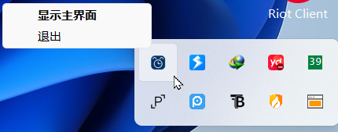

# 提醒管家 (Reminder Manager)


一款运行在 Windows 平台上的现代化桌面提醒工具。它致力于以极简、高颜值的 macOS 风格界面，帮助用户管理周期性的提醒任务。

## 📸 界面预览

<p align="center">
  
  
</p>

## ✨ 功能特性

- **macOS 风格界面**：极简设计，圆角卡片，流畅交互。
- **后台常驻**：支持最小化到系统托盘，不占用任务栏空间。
- **系统级通知**：集成 Windows 原生通知中心，确保不错过任何提醒。
- **开机自启**：支持设置开机自动启动，无感运行。
- **数据持久化**：自动保存任务配置，防止数据丢失。

## 🛠️ 技术栈

- **GUI 框架**: [customtkinter](https://github.com/TomSchimansky/CustomTkinter)
- **系统集成**: win11toast, pystray, pywin32
- **图像处理**: Pillow

## 📦 安装与运行

### 方式一：直接运行（推荐）

本项目提供了预编译的 `提醒管家.exe` 文件，无需安装 Python 环境即可直接使用：

1. 下载最新发布的 `提醒管家.exe`。
2. 双击直接运行即可。

### 方式二：源码运行

#### 1. 克隆仓库

```bash
git clone https://github.com/yourusername/reminder-manager.git
cd reminder-manager
```

#### 2. 安装依赖

```bash
pip install -r requirements.txt
```

#### 3. 运行程序

```bash
python main.py
```

## 🚀 打包发布

如果你想将其打包为 `.exe` 可执行文件，可以使用 `pyinstaller`：

```bash
pip install pyinstaller
pyinstaller -F -w -i src/app_icon.ico src/main.py -n "提醒管家"
```

## 📄 许可证

本项目采用 [MIT License](LICENSE) 开源。
